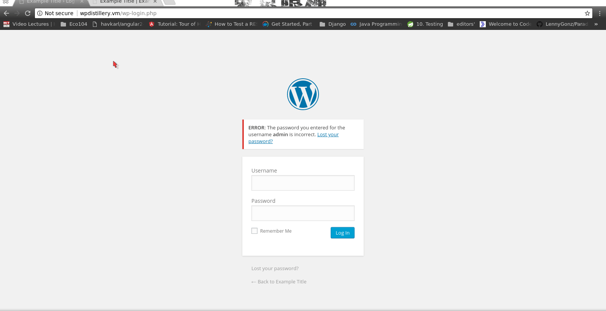
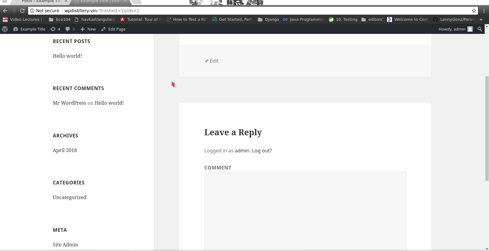
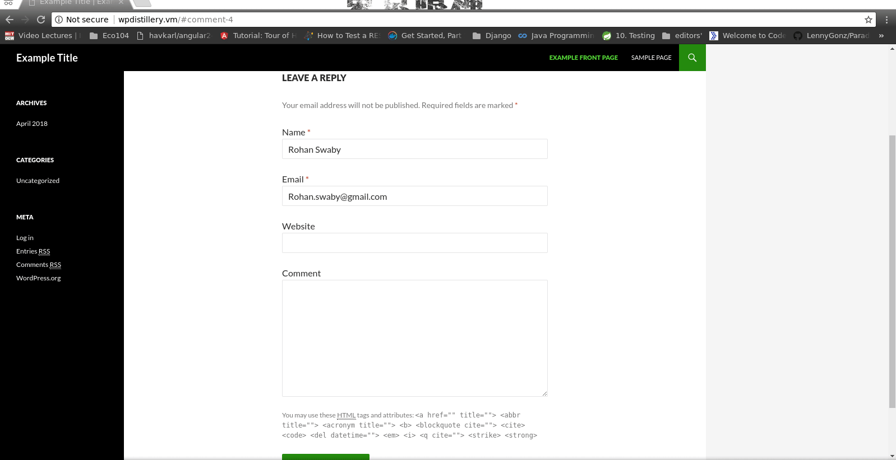

# Project 7 - WordPress Pentesting

Time spent: **X** hours spent in total

> Objective: Find, analyze, recreate, and document **five vulnerabilities** affecting an old version of WordPress

## Pentesting Report

1. Testing for User Enumeration and Guessable User Account
  - [ ] Summary: try random us
    - Vulnerability types: wrong password for a specific username can lead to bruteforcing password.
    - Tested in version: 4.2
    - Fixed in version: 4.7.5
  - [ ] GIF Walkthrough: 
  - [ ] Steps to recreate: Go through random User and depending on the Error message bruteforce to find the password

1. XSS 1 (Display Cookie)
    - Tested in version: 4.2.0
    - Fixed in version: 4.2.1
  - [ ] GIF Walkthrough:  
  - [ ] Steps to recreate: The Admin will add a comment using onmouseover and display the cookies
  - [ ] Affected source code:
    - [source](https://wpvulndb.com/vulnerabilities/8186)
1. XSS 2 
    - Tested in version: 4.2.0
    - Fixed in version: 4.7.0
  - [ ] GIF Walkthrough: 
  - [ ] Steps to recreate:
            1) User will add a comment
            2) admin will approve comment
            3) when admin views comment on page then alert pops up.
  - [ ] Affected source code:
    - [Link 1](https://wpvulndb.com/vulnerabilities/7945)

## Assets

List any additional assets, such as scripts or files
admin.git
cookie.gif
vulnerability.gif
## Resources

- [WordPress Source Browser](https://core.trac.wordpress.org/browser/)
- [WordPress Developer Reference](https://developer.wordpress.org/reference/)

GIFs created with [LiceCap](https://github.com/phw/peek).

## Notes

Describe any challenges encountered while doing the work

## License

    Copyright [yyyy] [name of copyright owner]

    Licensed under the Apache License, Version 2.0 (the "License");
    you may not use this file except in compliance with the License.
    You may obtain a copy of the License at

        http://www.apache.org/licenses/LICENSE-2.0

    Unless required by applicable law or agreed to in writing, software
    distributed under the License is distributed on an "AS IS" BASIS,
    WITHOUT WARRANTIES OR CONDITIONS OF ANY KIND, either express or implied.
    See the License for the specific language governing permissions and
    limitations under the License.
